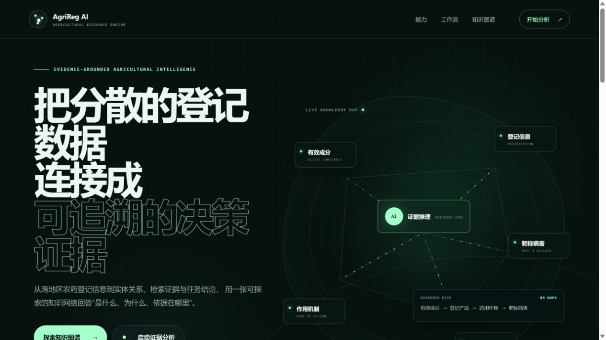
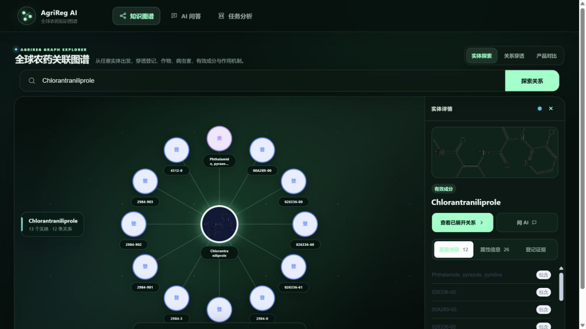
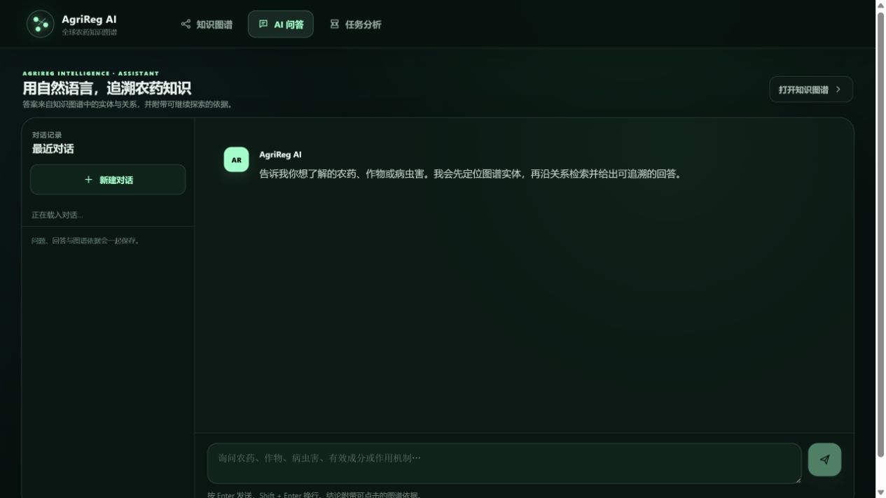
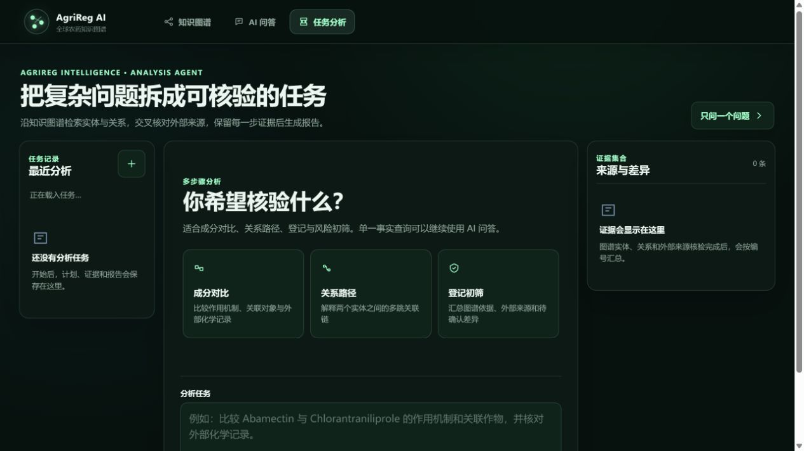
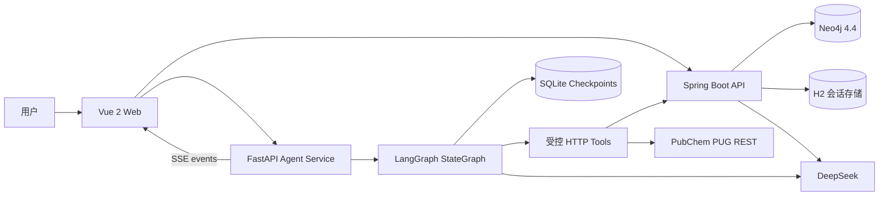
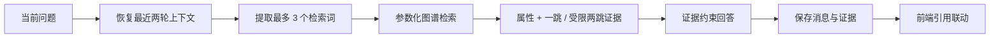
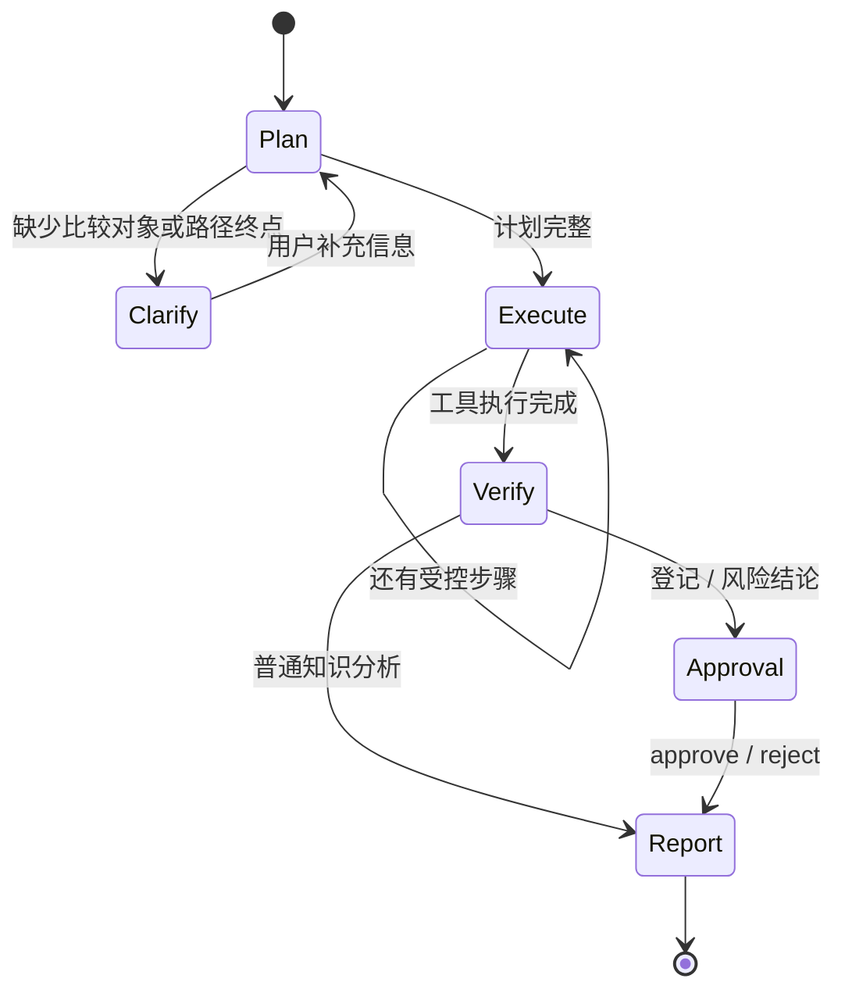

<h1 align="center">AgriReg AI</h1>

<p align="center">
  <strong>Evidence-Grounded Pesticide Knowledge Graph, GraphRAG & Stateful Agent</strong>
</p>

<p align="center">
  面向全球农药登记与植保知识的关系检索、可追溯问答与多步骤证据核验。
</p>

<p align="center">
  
  
  
  
  
  
  <a href="https://github.com/toututuya/Agrireg-AI/actions/workflows/ci.yml"></a>
  <a href="https://github.com/toututuya/Agrireg-AI/stargazers"></a>
</p>

<p align="center">
  <a href="#界面预览">界面预览</a> ·
  <a href="#核心能力">核心能力</a> ·
  <a href="#graphrag-流程">GraphRAG</a> ·
  <a href="#agrireg-agent-任务流">Agent</a> ·
  <a href="#量化评测">量化评测</a> ·
  <a href="#快速启动">快速启动</a> ·
  <a href="#验证结果与能力边界">能力边界</a> ·
  <a href="#roadmap--todo">Todo</a>
</p>

---

## 项目简介

AgriReg AI 将农药登记、作物、病虫害、有效成分、化学类别、作用靶点和作用方式组织为 Neo4j 多层关联网络，并围绕三个核心场景提供服务：

- **知识图谱工作台**：从任意实体出发，探索直接关系、登记穿透、最短路径与产品对比。
- **图谱增强问答**：从自然语言问题中识别实体，检索 Neo4j 属性与关系证据，再生成带 `[n]` 引用的回答。
- **多步骤任务分析**：对成分比较、关系路径和登记风险初筛进行任务规划，串联图谱、GraphRAG 与 PubChem 受控工具，检查来源差异，并在结论性报告前支持人工确认与断点恢复。

项目不是按国家拆分的信息门户。地区作为登记来源和监管语境保留在数据层，产品层关注跨来源检索、关系追踪和证据核验。

## 界面预览

<p align="center">
  
</p>

<table>
  <thead>
    <tr>
      <th width="34%">知识图谱工作台</th>
      <th width="33%">GraphRAG 智能问答</th>
      <th width="33%">Stateful Agent</th>
    </tr>
  </thead>
  <tbody>
    <tr>
      <td align="center"></td>
      <td align="center"></td>
      <td align="center"></td>
    </tr>
    <tr>
      <td>拖拽、缩放、筛选和增量展开实体；右侧查看图片、属性、登记证据与直接关联。</td>
      <td>在统一的证据工作区中恢复多轮对话；回答引用可跳回图谱并高亮对应证据。</td>
      <td>查看任务计划、工具执行、证据核验和人工确认状态，并从检查点继续长任务。</td>
    </tr>
  </tbody>
</table>

图谱工作台截图来自 `Chlorantraniliprole` 实体探索：API 从 Neo4j 返回 **13 个实体、12 条关系**，可继续拖动节点、展开邻域或查看登记与属性证据。

## 核心能力

| 能力 | 实现 |
| --- | --- |
| 实体探索 | 多属性检索，精确主名称优先，返回有界一跳邻域 |
| 图谱交互 | 原生 SVG 节点拖动、平移缩放、类型筛选、自动布局和增量展开 |
| 关系穿透 | 6 跳以内最短路径，展示实体、关系和路径解释 |
| 产品对比 | 对比两个登记产品的成分、作物、病虫害与共有关系 |
| 实体详情 | 图片、属性、直接关联和登记证据在独立侧栏内滚动 |
| GraphRAG | 固定检索模板获取属性与关系证据，模型依据编号证据生成回答 |
| 会话恢复 | H2 持久化最近对话、消息、识别实体和回答证据 |
| 证据联动 | 点击历史回答中的 `[n]`，返回图谱并高亮对应节点与关系 |
| Stateful Agent | LangGraph 状态图编排任务规划、受控工具路由、证据合并、冲突检查与报告生成 |
| Human-in-the-loop | 缺少实体时暂停补充；登记与风险结论在生成报告前进入批准 / 拒绝节点 |
| 长任务恢复 | SQLite Checkpointer 保存运行状态，Thread / Run / Event 模型支持中断后继续 |
| 实时进度 | SSE 只推送计划摘要、工具结果、证据与报告状态，不暴露模型隐藏推理 |
| 可复现评测 | 500 条结构集、50 条图谱一致性集、30 条外部来源候选基准 |

## 系统架构



前端不直接连接 Neo4j。Spring Boot 继续负责参数校验、参数化 Cypher、证据裁剪和固定 GraphRAG；独立 Python 服务只编排受控 HTTP 工具与长任务状态，不持有任意 Cypher 执行能力。

## GraphRAG 流程



1. 恢复当前会话最近两轮上下文，理解“它”“这个成分”等指代。
2. DeepSeek 只负责生成最多 3 个实体检索词，不直接执行任意 Cypher。
3. Neo4j 返回有界直接关系，并按需沿登记号补充受限两跳关系。
4. 同时提取 CAS、分子式、抗性分类和作用机制等受控属性证据。
5. 回答提示限制模型只能依据编号证据作答，并在结论后标注 `[n]`。
6. 问题、回答、实体和证据一起持久化，历史引用仍可重新高亮图谱。

固定 GraphRAG 仍服务低延迟单问单答；只有需要跨来源核验、动态步骤、人工确认或长任务恢复的请求进入 Agent。两条链路分开，避免让每一个简单问题都承担状态机和外部核验成本。

## AgriReg Agent 任务流



当前工具集只有五类：`search_entity`、`compare_entities`、`find_relation_path`、`grounded_answer` 和 `external_substance_lookup`。Agent 不能访问文件系统、Shell、数据库账号或任意网络地址；图谱工具统一调用 Spring Boot 的有界接口，外部核验当前只接 PubChem PUG REST。

运行采用 Thread / Run / Event 模型。LangGraph SQLite Checkpointer 保存节点状态，应用数据库保存用户可见事件；进程重启后运行会进入 `paused`，可从最近检查点继续。生产部署时可将两类 SQLite 存储替换为 PostgreSQL，并由同一 API Gateway 统一鉴权、限流和审计。

## 量化评测

### Direct DeepSeek vs GraphRAG

在 30 条外部来源候选问题上，使用同一个 `deepseek-v4-flash`、`temperature=0.1` 和非思考模式进行成对实验：

| 指标 | Direct DeepSeek | GraphRAG |
| --- | ---: | ---: |
| 外部事实命中率 | 86.67%（26/30） | **100%（30/30）** |
| P50 端到端延迟 | 0.99 s | 1.95 s |
| P95 端到端延迟 | 1.81 s | 2.92 s |
| 引用出现率 | — | 100% |
| 引用编号有效率 | — | 100% |

GraphRAG 在该候选集上提升 **13.33 个百分点**，但中位延迟增加约 **97.5%**。4 个成对差异样本的双侧精确 McNemar `p=0.125`，样本量不足以声称统计显著。

> [!IMPORTANT]
> 这 30 条目前是基于 PubChem、IRAC、FRAC 和 HRAC 的外部来源候选基准，尚未完成两位领域专家签字，不能表述为“专家金标准准确率 100%”。完整实验设计、差异样本和统计边界见 [对照实验报告](docs/EXTERNAL_ABLATION_REPORT_CN.md)。

### 三层评测体系

| 层级 | 数量 | 验证目标 | 当前结果 |
| --- | ---: | --- | --- |
| 结构化检索集 | 500 | 实体 ID、标签、路径长度、关系类型与查询延迟 | 实体与路径回归 100% |
| 图谱一致性集 | 50 | 正负例、证据端点、关系约束和引用编号 | 规则检查 50/50 |
| 外部来源候选集 | 30 | Direct DeepSeek 与 GraphRAG 外部事实命中率 | 26/30 vs 30/30 |

### Agent 工程验收

| 验收层 | 当前结果 | 覆盖内容 |
| --- | ---: | --- |
| Python 自动化测试 | 11/11 | 规划、工具白名单、证据去重、冲突检测、中断恢复、SQLite 持久化与异步 API 契约 |
| 路由契约集 | 12/12 | 事实查询、实体比较、关系路径、缺失信息和合规审批路由 |
| 本机真实链路 | 2/2 | Neo4j + Spring Boot + GraphRAG + PubChem + DeepSeek；普通报告与人工确认恢复各 1 条 |

真实链路中，`Chlorantraniliprole` 任务完成 3 个受控工具调用，汇总 48 条去重证据；`Abamectin` 风险初筛同样完成 3 个工具调用，在 48 条证据和 1 组字段差异后暂停等待批准，恢复后生成报告。这里验证的是工程链路与状态语义，不等同于领域答案准确率评测。

评测脚本随源码提交，`evaluation/generated/` 和 `evaluation/results/` 中的本地图谱明细不提交。这样既能复现指标计算逻辑，也不会公开数据库内部节点 ID 或本地运行记录。

## 数据规模

原始图谱快照包含 22,328 个节点和 145,579 条关系。完成可复现清洗后，当前服务图谱包含：

| 指标 | 数量 |
| --- | ---: |
| 节点 | 21,712 |
| 关系 | 120,776 |
| 农药登记 | 16,216 |
| 有效成分 | 318 |
| 作物 | 3,112 |
| 病虫害 | 2,382 |
| 实体 / 关系类型 | 8 / 6 |

仓库不包含 Neo4j store 和原始爬取文件。数据结构、清洗过程和治理边界见 [数据清洗报告](docs/DATA_CLEANING_REPORT_CN.md)、[数据治理说明](docs/DATA_GOVERNANCE_CN.md) 和 [DATA_NOT_INCLUDED.md](DATA_NOT_INCLUDED.md)。

## 技术栈

| 层级 | 技术 |
| --- | --- |
| Web | Vue 2、Vue Router、Axios、原生 SVG / CSS |
| API | Java、Spring Boot 2.3、Spring Data Neo4j、Spring JDBC |
| Graph | Neo4j 4.4、参数化 Cypher |
| GraphRAG | DeepSeek OpenAI-compatible Chat Completions API |
| Conversation | H2 文件数据库，可替换为 PostgreSQL |
| Agent | Python 3.11+、FastAPI、LangGraph 1.x、SQLite Checkpointer、SSE、Pydantic、HTTPX |
| Evaluation | Python、确定性概念匹配、P50/P95、成对对照实验 |

## 快速启动

### 环境要求

- Node.js 22.13+
- pnpm 11+
- Java 8+
- Maven 3.6+
- Neo4j 4.4.x
- Python 3.11+

### 1. 配置并启动 API

```powershell
cd api
Copy-Item .env.example .env.local
# 在 .env.local 中填写本机 Neo4j 配置和可选的 DeepSeek Key
.\start-local.ps1
```

启用智能问答：

```dotenv
DEEPSEEK_ENABLED=true
DEEPSEEK_API_KEY=your-api-key
DEEPSEEK_MODEL=deepseek-v4-flash
```

真实 `.env.local`、API Key 和 H2 对话文件不会提交到 GitHub。

### 2. 启动 Agent（多步骤任务需要）

```powershell
cd agent
python -m venv .venv
.\.venv\Scripts\python -m pip install -e ".[dev]"
Copy-Item .env.example .env.local
.\.venv\Scripts\python -m uvicorn agrireg_agent.api:app --host 127.0.0.1 --port 8091
```

在 `agent/.env.local` 中配置 Spring API 地址与可选的 DeepSeek Key。关闭 DeepSeek 时仍可运行确定性规划、工具链和检查点流程；启用后使用结构化规划与证据化报告生成。

### 3. 启动 Web

```powershell
cd web
pnpm install --frozen-lockfile
pnpm serve
```

打开：

- 产品首页：`http://127.0.0.1:8082/`
- 知识图谱：`http://127.0.0.1:8082/graph`
- AI 问答：`http://127.0.0.1:8082/ask`
- 任务分析：`http://127.0.0.1:8082/agent`

生产构建：

```powershell
pnpm build
python tools/spa_server.py --directory dist --port 8082
```

> 完整数据不随仓库发布，因此全量图谱查询需要自行准备符合项目 Schema 的 Neo4j 数据。没有 DeepSeek Key 时仍可运行图谱工作台，AI 问答不可用。

## 复现评测

启动 Neo4j 与 API 后，在项目根目录执行：

```powershell
# 生成本地图谱结构集和语义集
python evaluation/generate_dataset.py

# 结构检索与 GraphRAG 图谱一致性评测
python evaluation/run_eval.py --suite all --tag local-current

# Direct DeepSeek 与 GraphRAG 外部对照
python evaluation/compare_direct_vs_graphrag.py --tag external-local
```

对照实验会把问题和相应图谱证据发送给配置的 DeepSeek API，运行前应确认数据使用范围。专家复核流程见 [外部来源候选集说明](evaluation/external_gold/README_CN.md)。

## 核心 API

| 方法 | 路径 | 说明 |
| --- | --- | --- |
| `GET` | `/api/health` | 服务健康状态 |
| `GET` | `/api/graph/stats` | 节点与关系统计 |
| `GET` | `/api/graph/search?keyword=...` | 实体检索与一跳邻域 |
| `GET` | `/api/graph/node/{nodeId}` | 按节点增量展开 |
| `GET` | `/api/graph/path?source=...&target=...` | 6 跳内最短路径 |
| `POST` | `/api/assistant/ask` | 基于图谱证据的问答 |
| `GET` | `/api/conversations?visitorId=...` | 最近对话列表 |
| `GET` | `/api/conversations/{id}?visitorId=...` | 恢复消息与证据 |
| `DELETE` | `/api/conversations/{id}?visitorId=...` | 删除一条对话 |
| `POST` | `:8091/api/agent/threads` | 创建可持久化任务线程 |
| `POST` | `:8091/api/agent/threads/{threadId}/runs` | 启动一次多步骤分析 |
| `GET` | `:8091/api/agent/threads/{threadId}/runs/{runId}/events` | SSE 订阅用户可见进度 |
| `POST` | `:8091/api/agent/threads/{threadId}/runs/{runId}/resume` | 补充信息或批准 / 拒绝 |

## 项目结构

```text
.
├─ web/                         # Vue 知识图谱与 AI 问答前端
├─ api/                         # Spring Boot 图谱、问答与会话 API
├─ agent/                       # FastAPI + LangGraph 多步骤 Agent、检查点与测试
├─ evaluation/                  # 数据集生成、评测与外部对照实验
│  └─ external_gold/            # 外部候选事实与专家复核模板
├─ ops/data-cleaning/           # 可复现图谱清洗和审计 Cypher
├─ docs/                        # 架构、数据治理、评测与面试说明
├─ .github/workflows/ci.yml      # API、Web 与评测脚本自动检查
├─ DATA_NOT_INCLUDED.md         # 未随仓库发布的数据边界
└─ README.md
```

## 验证结果与能力边界

### 已验证

- Vue 生产构建通过，Spring Boot Maven 构建通过。
- `Chlorantraniliprole` 可精确命中 `ActiveSubstance` 并返回属性和登记关系。
- `Prothioconazole → 登记号 → Spring barley` 两跳关系可查询。
- 最近对话、多轮指代、历史恢复和证据重新高亮可运行。
- 500 条结构评测、50 条图谱一致性评测和 30 条外部来源候选对照已执行。
- Agent 11 个自动化测试与 12 个路由契约通过；真实图谱普通任务和人工确认任务均完成。
- `/agent` 在 1440px 与 375px 下完成浏览器检查，无页面横向滚动；SSE 可实时更新任务时间线、证据和报告。

### 能力边界

- 仓库不包含完整 Neo4j 数据库、原始爬取文件或用户对话数据。
- 当前缺少公开可复现的数据采集流水线，无法仅依赖本仓库重建完整 2.1 万节点图谱。
- 外部 30 条候选集仍需要两位领域专家复核，不能包装成正式专家金标准。
- 当前指标来自本机顺序请求，不代表生产并发性能。
- 系统用于关系检索、植保知识查询和合规初筛，不能替代法规、登记标签和领域专家的最终判断。
- 本地 Thread / Run 接口尚未接入账户鉴权；公开部署前需要通过 API Gateway 加入身份认证、租户隔离、限流与审计。

## Roadmap / Todo

路线图按“数据可信度 → 检索与评测 → 工程化 → Agent 化”排序。完成状态以代码、测试或可复现实验为准，不以页面演示代替验收。

### P0 · 数据可信度

- [x] 建立可复现的图谱清洗、审计和索引脚本。
- [x] 建立 30 条 PubChem / IRAC / FRAC / HRAC 外部来源候选集和专家复核门禁。
- [ ] 邀请两位农药登记或植保领域人员独立复核候选集，优先解决 Abamectin 分子式和 FRAC code / target-site group 的口径歧义。
- [ ] 为实体与关系补齐 `sourceUrl`、`jurisdiction`、`collectedAt`、`updatedAt` 和原始记录标识。
- [ ] 完成同义词、大小写、地区名称、机器翻译和重复实体治理，并输出清洗前后差异报告。
- [ ] 发布不含受限原始数据的最小示例数据集与一键导入脚本，使仓库可以独立运行完整演示链路。

### P1 · 检索与评测

- [x] 完成 500 条结构回归、50 条图谱一致性问题和 Direct DeepSeek / GraphRAG 成对实验。
- [x] 完成回答引用、历史证据恢复和点击证据高亮图谱。
- [ ] 将外部来源集扩展为 100–200 条分层问题，覆盖化学身份、登记、作物、病虫害、作用机制、比较和多跳查询。
- [ ] 引入别名、拼写容错和中英文名称的 full-text / hybrid retrieval，并评估实体命中率与召回率。
- [ ] 建立人工忠实度评分，区分“引用编号存在”“证据支持结论”和“结论符合外部来源”。
- [ ] 补充并发压测、冷启动与热缓存对照，报告吞吐量、错误率和 P50/P95/P99。

### P2 · 工程化

- [x] 前端、后端和评测脚本接入 GitHub Actions。
- [ ] 增加 Docker Compose，统一启动 Web、API、Neo4j 和可选的 PostgreSQL。
- [ ] 将内部 Neo4j node id 替换为稳定业务 ID，并为大结果集增加游标分页。
- [ ] 将本地 H2 会话迁移到 PostgreSQL，增加账户登录、会话隔离和数据保留策略。
- [ ] 增加可观测性：结构化日志、调用链、Neo4j 查询耗时、LLM token 与失败原因统计。

### P3 · Agent 化

- [x] 加入“图谱检索 → PubChem 外部核验 → 冲突检测 → 报告生成”的多步骤任务。
- [x] 使用 LangGraph 实现动态工具步骤、缺失信息中断、人工确认和 SQLite 检查点恢复。
- [x] 将成分检索、产品对比、关系路径、GraphRAG 和外部来源封装为受控 HTTP 工具，禁止 Agent 执行无界 Cypher。
- [x] 新增任务工作台，使用 SSE 展示用户可见的计划、工具、证据、差异与报告事件。
- [ ] 加入更多登记主管部门原文工具，并为来源可用性、字段新鲜度和跨来源冲突建立独立评测集。
- [ ] 仅在全图离线计算规模和业务需求成立时引入 GraphX，用于社区发现、相似性或关联传播，并将结果写回 Neo4j 供在线查询。

## 文档

- [架构与关键决策](docs/ARCHITECTURE.md)
- [Agent 架构、开源参考与安全边界](docs/AGENT_ARCHITECTURE_CN.md)
- [Agent 工程验收报告](docs/AGENT_EVALUATION_CN.md)
- [项目讲解与面试题](docs/PRODUCT_AND_INTERVIEW_CN.md)
- [GraphRAG 评测与检索优化](docs/EVALUATION_REPORT_CN.md)
- [Direct DeepSeek 与 GraphRAG 对照实验](docs/EXTERNAL_ABLATION_REPORT_CN.md)
- [全球农药登记数据治理](docs/DATA_GOVERNANCE_CN.md)
- [数据清洗报告](docs/DATA_CLEANING_REPORT_CN.md)
- [评测集生成与复现](evaluation/README_CN.md)
- [前端运行说明](web/README.md)
- [后端运行说明](api/README.md)

## 仓库安全边界

`.gitignore` 已排除 API Key、Neo4j 口令、本地路径、H2/Neo4j 数据、生成评测明细、构建产物、依赖目录、缓存和日志。仓库保留前后端源码、公开候选事实、评测脚本和指标文档，使 README 中的量化结论可以被检查。

## License

当前仓库尚未选择开源许可证。公开可见不等于允许复制、修改或再发布；请在确认原始代码和第三方组件的授权边界后再添加许可证。
