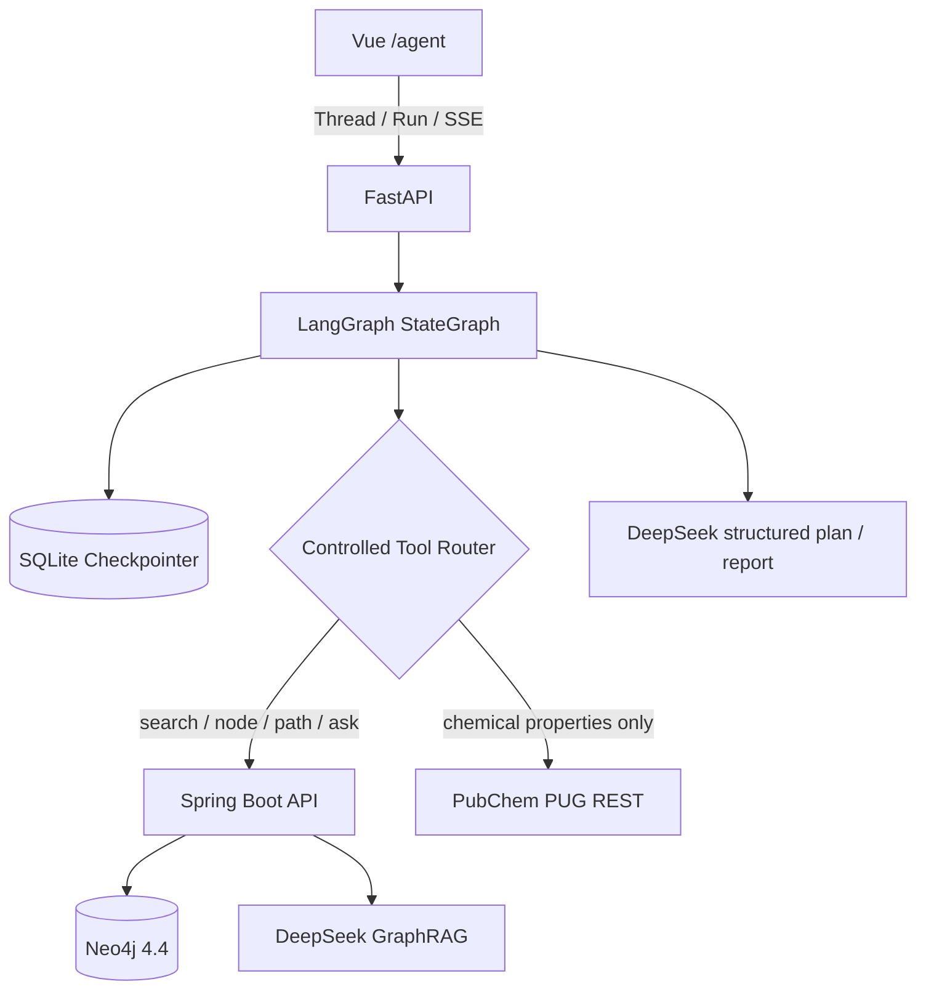

# AgriReg Agent 架构与开源参考

## 为什么这个场景需要 Agent

固定 GraphRAG 适合“输入一个问题、执行一套固定检索、返回一个答案”。成分比较、登记风险初筛和跨来源核验则包含不同实体数量、工具组合、外部来源可用性、字段冲突和人工确认，执行路径会随中间结果变化；同时任务可能持续数十秒，需要在页面刷新或服务重启后恢复。

因此 AgriReg Agent 面向的是“证据驱动的农业知识分析”，不是增加一个聊天气泡：

1. 把复杂任务变成结构化步骤；
2. 只调用白名单工具，禁止任意 Cypher 和任意网络访问；
3. 合并图谱、GraphRAG 与外部化学记录，并保留编号证据；
4. 对 CAS、分子式等字段做确定性冲突检查；
5. 在登记 / 风险结论前暂停，等待人工批准或拒绝；
6. 用检查点恢复中断任务，通过 SSE 展示用户可见状态。

## GitHub 参考项目与取舍

实现前检索并阅读了下列官方仓库：

- [langchain-ai/langgraph-101](https://github.com/langchain-ai/langgraph-101)：采用 `StateGraph`、`Command`、`interrupt` 和显式状态节点；本项目复用这些基础原语，但不复制研究型多 Agent。
- [langchain-ai/open_deep_research](https://github.com/langchain-ai/open_deep_research)：参考“澄清 → 计划 → 执行 → 报告”阶段和结构化输出；本项目将并行研究者收缩为农业领域单状态图。
- [langchain-ai/deployment-cookbook](https://github.com/langchain-ai/deployment-cookbook)：参考 Thread / Run、状态查询、历史与流式事件的部署协议形态。
- [langchain-ai/agent-chat-ui](https://github.com/langchain-ai/agent-chat-ui)：参考工具结果、interrupt 和 artifact 的独立展示；本项目使用 Vue 2 重新实现任务时间线、确认卡、证据栏和报告，不引入 React UI 依赖。

没有采用通用 ReAct + 任意工具，也没有使用 supervisor / 多 Agent。当前五类工具边界明确，单状态图更容易测试、恢复和解释；当未来存在真正独立的法规检索、文献检索和登记核验团队任务时，再评估子图或多 Agent。

## 服务边界

### 白名单工具

| 工具 | 输入 | 下游 | 边界 |
| --- | --- | --- | --- |
| `search_entity` | 单个关键词 | `/api/graph/search` | 最多 80 字符，Spring 返回有界邻域 |
| `compare_entities` | 左右两个实体 | 两次实体检索 | 不执行集合写入或数据库修改 |
| `find_relation_path` | 起点 / 终点 | `/api/graph/path` | Spring 限制最短路径不超过 6 跳 |
| `grounded_answer` | 原始问题 | `/api/assistant/ask` | 使用现有编号图谱证据链 |
| `external_substance_lookup` | 成分名称 | PubChem PUG REST | 固定域名、固定属性集、最多 3 条记录 |

## 状态与中断

核心状态包含问题、结构化计划、当前步骤、工具结果、原始证据、去重证据、字段冲突、证据覆盖、人工决定和最终报告。执行记录与 LangGraph 状态分开保存：

- Checkpointer 用于精确恢复图节点；
- Run Store 用于线程列表、状态、interrupt、报告和用户可见事件；
- 运行进程意外退出后，`running` 记录会恢复为 `paused`，再次调用 resume 从最近检查点继续；
- SSE 事件不包含思维链，只包含计划摘要、工具完成 / 失败、证据数量、冲突数量、人工确认和报告状态。

## 生产部署差距

当前版本已达到可运行的本机工程闭环，但公开生产部署仍需：

- 在 API Gateway 加入 OAuth / JWT、租户隔离、速率限制和审计日志；
- 将两类 SQLite 存储迁移到 PostgreSQL，并以任务队列承载多实例 Worker；
- 为外部来源增加缓存、熔断、重试预算和来源新鲜度；
- 对提示词、工具选择、证据忠实度、冲突召回和人工采纳率建立持续评测；
- 将 LLM token、工具延迟、失败原因和 run trace 接入可观测平台。

