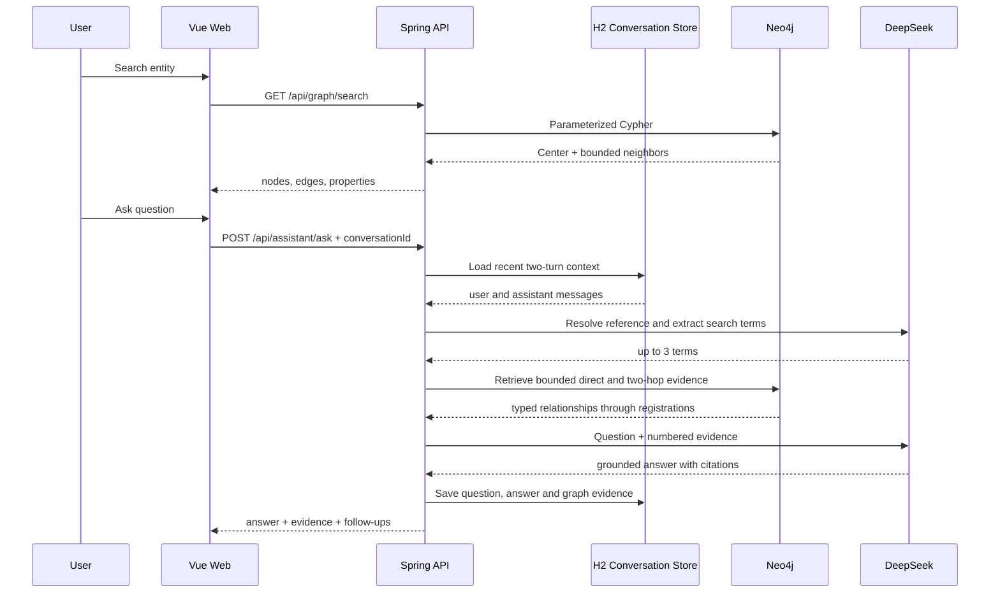

# Architecture and decisions

## Request paths

## Why Neo4j instead of GraphX

当前规模约 2.2 万节点、14.6 万关系，核心请求是交互式邻域检索和短路径分析。Neo4j 的 Cypher 与索引更适合毫秒到秒级在线查询；引入 Spark GraphX 会增加数据同步、集群运维和离线/在线一致性成本。

当数据达到数亿级边、需要全图 PageRank、连通分量或大规模社区发现时，可以把 Neo4j 作为在线服务层，把离线图计算结果从 Spark 回写 Neo4j。当前阶段不应为了简历关键词提前引入。

## Why a separate LangGraph service now

固定 GraphRAG 继续由 Java 显式编排，负责低延迟问答。新增任务具备受控工具路由、跨来源核验、字段冲突检查、人工确认和长任务恢复，这些状态转换已达到引入状态图的条件。

Agent 使用独立 Python 服务，原因不是绕开现有后端，而是保持职责清晰：

- Spring Boot 持有 Neo4j 连接、参数化 Cypher、证据裁剪与会话数据；
- LangGraph 只持有任务状态和受控 HTTP 工具，不直接连接 Neo4j；
- Vue 同时提供 `/ask` 快速问答和 `/agent` 多步骤任务工作台；
- SQLite Checkpointer 保存节点状态，SSE 只输出用户可见事件，不输出隐藏推理。

## Known next steps

- 使用 Neo4j full-text index 替代多属性全扫描；
- 用稳定业务 ID 替代 Neo4j 内部节点 ID；
- 加入来源、管辖区、登记状态和生效时间；
- 构建小型公开样例图与幂等导入脚本；
- 为检索召回率、证据覆盖率和答案忠实度增加评测集。
- 将 Agent 的本地 SQLite Checkpointer 与运行记录迁移到 PostgreSQL，并加入账户鉴权、限流和审计。
