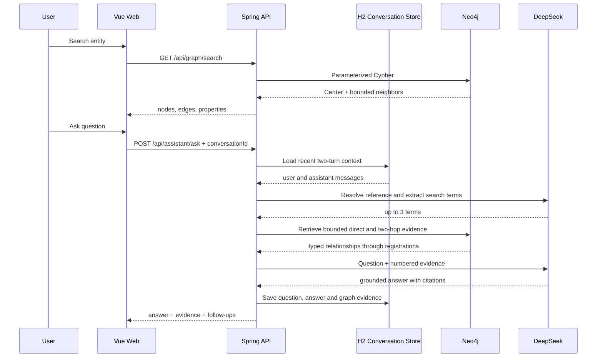

# Architecture and decisions

## Request paths

## Why Neo4j instead of GraphX

当前规模约 2.2 万节点、14.6 万关系，核心请求是交互式邻域检索和短路径分析。Neo4j 的 Cypher 与索引更适合毫秒到秒级在线查询；引入 Spark GraphX 会增加数据同步、集群运维和离线/在线一致性成本。

当数据达到数亿级边、需要全图 PageRank、连通分量或大规模社区发现时，可以把 Neo4j 作为在线服务层，把离线图计算结果从 Spark 回写 Neo4j。当前阶段不应为了简历关键词提前引入。

## Why not LangGraph yet

当前问答是有会话状态、但检索流程固定的两阶段 GraphRAG。保存多轮消息本身不需要状态机框架，显式 Java 编排拥有更少依赖和更清晰的失败边界。LangGraph 的合理触发条件包括：

- 多个检索工具需要动态路由；
- 需要查询改写、结果验证和重试循环；
- 需要人工确认高风险建议；
- 需要跨来源原文核验、冲突检测和报告生成；
- 需要持久化并恢复耗时较长的研究任务。

## Known next steps

- 使用 Neo4j full-text index 替代多属性全扫描；
- 用稳定业务 ID 替代 Neo4j 内部节点 ID；
- 加入来源、管辖区、登记状态和生效时间；
- 构建小型公开样例图与幂等导入脚本；
- 为检索召回率、证据覆盖率和答案忠实度增加评测集。
- 增加来源文档、图谱查询、产品比较和报告导出工具，再把固定 GraphRAG 升级为有边界的工作流 Agent。
